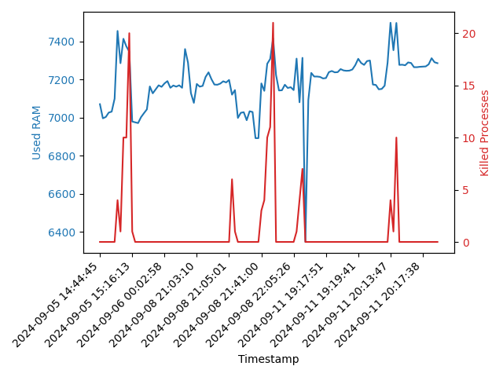

## <div align="center">Proyecto #1 </div>
## <div align="center">Gestor de Contenedores </div>
##### <div align="center">Sistemas Operativos 1 - Sección A</div>
##### <div align="center">8 de septiembre de 2024</div>
___

#### **<div align="center">Introducción</div>**

<p align="justify">
El proyecto 1 del curso de Sistemas Operativos 1, ha consistido en un gestor de contenedores elaborado con muchas herramientas; entre ellas se pueden mencionar, la utilización de modulos de kernel de Linux, elaboración de un servicio/programa gestor de contenedores en el lenguaje de programación Rust, utilización del lenguaje de programación Python para la elaboración de un servicio utilizando FastApi y Matplotlib para generación de gráficas y con la utilización de los conceptos básicos y primordiales de contenedores de la plataforma Docker. 

Todo fue hecho con base al sistema operativo de Linux en su distribución Ubuntu 22.04 LTS.
</p>

___


#### **<div align="center">Resumen</div>**

<p align="justify">
En resumen el proyecto 1, ha consistido en la elaboración de un programa que sea útil para la gestión de contenedores en una computadora, con el objetivo primordial de poder gestionar los recursos de la misma; tomando con prioridad a la Memoria RAM Y el CPU. Esto para poder asegurar que el flujo del programa sea continuo y que no existan problemas que afecten a la computadora como tal.

 En este caso el flujo consiste en cuatro secciones importantes.


1. Creación de 10 **Contenedores Docker** con un Script Bash, con base en 2 Imagenes Docker de Alto Consumo y 2 Imagenes Docker de Bajo Consumo. (Cada 1 minuto se repite la creación)
2. Creación de un **Módulo de Kernel**, que lee constantemente información relacionada con los procesos de los contenedores Docker, donde escribe en formato JSON en un archivo llamado sysinfo_202110206 en la carpeta /proc.
3. Ejecución de **programa/servicio Rust**, que consiste en el gestor de contenedores, que lee el archivo sysinfo_202110206, deserealiza la información tipo JSON, las almacena en structs de Rust y en Vectores, para que puedan ser ordenados según 4 parámetros importantes: RAM, CPU, VSZ y RSS. Se realizan estos ordenamientos para dividirlos en procesos de contenedores de alto y procesos contenedores de bajo consumo. Ya luego se realiza la eliminación procurando dejar siempre 2 contenedores de alto consumo corriendo y 3 contenedores de bajo consumo corriendo. Luego se envía la información de los contenedores matados como logs o información, en formato JSON, para realizar una consulta HTTP al Servicio de Python.
4. Creación de **Servicio Python** elaborado con FastApi y Matplotlib, este se inicia con un docker-compose.yml automaticamente dentro del Servicio Rust. Será el manejador de los endpoints, para recibir los logs de Memoria RAM y la información de Contenedores Matados desde el Servicio Rust, aparte de manejar el endpoint de la elaboración de gráficas con base a la información almacenada en los logs recibidos desde el Servicio Rust.

A continuación se detalla cada sección del proyecto más a profundidad.

</p>


___

#### **<div align="center">Creación de Contenedores Docker con Script en Bash y Cronjob</div>**

<div align="center"></div>


Para la creación de los contenedores con un script en Bash; se tomó primero en cuenta la restricción de los tipos de imagenes que se deben de crear en Docker. Que serían:

* **Imágenes de alto consumo**
    * [high_image1](./Containers/high_image1/main.py): Se centra en un programa en Python con un ciclo infinito y una pausa de 0.1 segundos, que muestra un mensaje continuo en cada iteración con la fecha y hora del día actual.
    * [high_image2](./Containers/high_image2/heavy.js): Se centra en un programa en JavaScript que contiene un ciclo while infinito con una pausa de 100 milisegundos, que realiza una operación matemática intensiva de potenciación y la impresión de un mensaje en consola.
* **Imágenes de bajo consumo**
    * [low_image1](./Containers/low_image1/app.js) Se centra en un servidor sencillo en JavaScript.
    * [low_image2](./Containers/low_image2/app.py): Se centra en un servidor en Python, utilizando Flask.


Para crear las 4 imágenes, se utilizaron los siguientes comandos:

```bash
#Se utiliza el comando dentro de cada directorio respectivo, donde se encuentra el programa y su Dockerfile, para crear la imagen.
sudo docker build -t high_image1 .

sudo docker build -t high_image2 .

sudo docker build -t low_image1 .

sudo docker build -t low_image2 .
```


___

Tomando como base esas restricciones, se realizó un script en Bash [scriptdocker.sh](./Containers/scriptdocker.sh), para poder realizar la creación automática de 10 contenedores de forma aleatoria, tomando como base las 4 imágenes descritas anteriormente. 

Ahora bien, para que el script en bash se ejecute de forma automática cada cierta cantidad de tiempo, se realiza un cronjob para que se ejecute el script cada minuto.

Recordar que siempre se habilitan los permisos de ejecución para el script con el comando: 

```bash
chmod +x scriptdocker.sh 
```
Esto con el objetivo de que se pueda acceder al script.
___

Se realizó otro script bash llamado [cronjob.sh](./Containers/cronjob.sh). Este consiste en la ejecución del script anteriormente descrito [scriptdocker.sh](./Containers/scriptdocker.sh).  por medio de un ciclo while, cada 60 segundos. 

**¿Por qué cada 60 segundos?**

Se realiza cada minuto (60 segundos) por cuestión de recursos de la computadora con la que se trabaja este proyecto. Para no llegar más allá de los recursos.

Se le brinda igual los mismos permisos de ejecución.

```bash
chmod +x scriptdocker.sh 
```

Se ejecuta el script creador de contenedores de la siguiente forma:

```bash
cd Escritorio/LAB_SOPES1/SO1_2S2024_202110206/Proyecto1/Containers

./cronjob.sh
```

_____


#### **<div align="center">Creación de módulo de Kernel</div>**


El modulo de kernel elaborado para el proyecto [sysinfo_202110206.c](./Module/sysinfo_202110206.c) consiste en un modulo para leer informacion de memoria RAM de la computadora y recursos consumidos por los procesos relaciandos a los contenedores Docker. Para la transformación de esa información en formato JSON en el archivo *sysinfo_202110206* en la carpeta /proc. 


* Se utilizaron structs sysinfo y task_struct, muy importantes para obtener directamente la siguiente información con sus atributos: 

1. Memoria RAM 
    * Memoria RAM Total
    * Memoria RAM Libre
    * Memoria RAM en uso

2. Información Proceso Docker
    * PID
    * NOmbre
    * Cmdline
    * Vsz
    * Rss
    * % RAM 
    * % CPU

 

Como se puede ver en las imagenes anteriores, se captura la información por medio de esos structs y se llama, y se construye de una vez en formato JSON la información que se guardará en el archivo sysinfo_202110206 en /proc.

#### Ejemplo Estructura Archivo


 

#### Comandos importantes para instalación de modulo de kernel


```bash
make (generación de archivos compilados para sysinfo_202110206.c)

sudo insmod sysinfo_202110206.ko
```

*Desinstalación*

```bash
sudo rmmod sysinfo_202110206
```

*Eliminar compilados*


```bash
make clean
```
____

#### **<div align="center">Servicio en Rust (Gestor de Contenedores)</div>**

<div align="center">
    
</div>


Para ejecutar el servicio de Rust, se puede utilizar los compilados generados en la carpeta debug (depuracion) o en la carpeta target (release).

Para su compilado en release:

```bash
cd Escritorio/LAB_SOPES1/SO1_2S2024_202110206/Proyecto1/RustService/target/release 

./RustService
```
____

Este es el programa que contiene el funcionamiento más importante detrás del [Proyecto #1](/SO1_2S2024_202110206/Proyecto1/RustService/src/main.rs). Que trabaja como un gestor de contenedores Docker, con los siguientes funcionamientos.

1. Lee el archivo sysinfo_202110206 en la carpeta /proc, donde contiene la información en formato JSON, de los procesos relacionados a los contenedores de Docker que están corriendo en ese momento y también la información de la memoria RAM.

2. Se deserializa la información en formato JSON para guardarlo en un struct llamado Sysinfo, y después almacenarlo en Processes y Rammemory, para luego almacenarlo en diferentes structs. 

3. Al manejar la información de los procesos, se realiza una serie de ordenamientos por:
    * RAM
    * CPU
    * VSZ
    * RSS
4. Después se organizan y se toman los contenedores de alto consumo y los contenedores de bajo consumo, para luego ya realizado los ordenamientos, se realiza la eliminación de contenedores, dejando solo 2 de alto consumo y 3 de bajo consumo por cada iteración de ciclo.
5. Se imprime en la consola la información, de los contenedores de alto consumo y de bajo consumo, los contenedores que se van eliminando y la información de memoria RAM.

6. Se envían logs de registro de Memoria RAM e información de Contenedores eliminados al servidor de Python.

7. Para la terminación del servicio, al teclear Ctrl+C, se realiza la terminación, mandando una señal, y una request HTTP GET al servidor python para crear las graficas respectivas, al igual que la terminación del proceso del contenedor python de FastAPi.


**Funciones Importantes**

1. Kill_container: Mata contenedores, haciendo una comparación con el id capturado del servicio python.

2. Main: Controla, y realiza primer el docker compose del servidor python, luego la lectura, captura el id, luego realiza ya las iteraciones para los ordenamientos y eliminacion de contenedores, y mandar esa informacion al server python.


____

#### **<div align="center">Servidor en Python y Graficador</div>**

<div align="center">
    
</div>


**ENDPOINTS**

- */logs:*

Para el recibimiento de los registros de memoria RAM Y de informacion de procesos eliminados.


- */graph*


- */scatter_vsz_rss*


**EJEMPLOS DE GRÁFICAS** 

1. Uso de Memoria RAM y Cantidad de procesos eliminados vs Tiempo



2. Vsz vs Rss de Procesos Eliminados de Contenedores Docker


