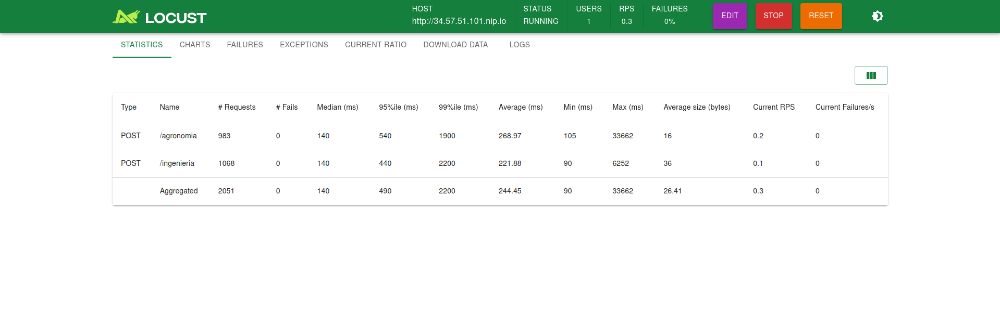

### 
LOCUST

Es una herramienta open source para HTTP y otros protocolos. Permite hacer testeos de carga de datos en lenguaje Python.

En este caso para el proyecto servirá para ingresar datos de forma automática para poder testear los contenedores, que forman parte del proyecto de olimpiadas.

