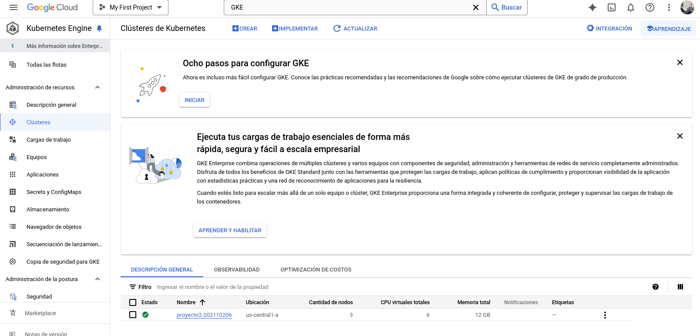

## <div align="center">Proyecto #2</div>
### <div align="center">Kubernetes y Servicios</div>
#### <div align="center">Olimpiadas USAC</div>
##### <div align="center">Sistemas Operativos 1 - Sección A</div>
##### <div align="center">1 de noviembre de 2024</div>
___

#### **<div align="center">Introducción</div>**


____


#### **<div align="center">Configuracion Inicial GKE</div>**

Se configuran reglas de firewall para habilitar tráfico externo de entrada y de salida.


Comando para crear cluster:

```bash
gcloud container clusters create proyecto2-202110206 \
    --zone us-central1-a \
    --num-nodes 5 \
    --disk-type=pd-standard \
    --disk-size=100
```



```bash
# Aplicar namespace

kubectl apply -f namespace.yaml
```

#### **<div align="center">Comandos de Kubernetes</div>**

Creación de reglas de firewall de entrada y salida.

Instalación de Helm y NGINX-Ingress-Controller para poder facilitar la entrada de tráfico en la arquitectura.

#### 1. Ingress

Permite la entrada de tráfico, mediante Locust

Usar NGINX controller con Helm: 

```bash
curl https://baltocdn.com/helm/signing.asc | gpg --dearmor | sudo tee /usr/share/keyrings/helm.gpg > /dev/null
sudo apt-get install apt-transport-https --yes
echo "deb [arch=$(dpkg --print-architecture) signed-by=/usr/share/keyrings/helm.gpg] https://baltocdn.com/helm/stable/debian/ all main" | sudo tee /etc/apt/sources.list.d/helm-stable-debian.list
sudo apt-get update
sudo apt-get install helm
```

Para crear ingress para poder enviar peticiones, se utiliza nginx-ingress.

```bash
kubectl create ns nginx-ingress
helm repo add ingress-nginx https://kubernetes.github.io/ingress-nginx 
helm repo update 
helm install nginx-ingress ingress-nginx/ingress-nginx -n nginx-ingress
kubectl get services -n nginx-ingress # Se obtiene la IP Load Balancer, la misma de INGRESS
```

Se ingresa el host en Locust: http://34.57.51.101.nip.io (Es la IP del balanceador de carga)


```bash
# Aplicar ingress

kubectl apply -f ingress.yaml
```


#### 2. Facultades

- Aplicación de Deployment y Service 

```bash
# AGRONOMIA
kubectl apply -f goclient.yaml

# INGENIERIA
kubectl apply -f rustclient.yaml
```


#### 2. Disciplinas

- Aplicación de Deployment y Service

```bash
# NATACION
kubectl apply -f gonatacion.yaml

# BOXEO
kubectl apply -f goboxeo.yaml

# ATLETISMO
kubectl apply -f goatletismo.yaml
```


#### 3. Kafka

Se utiliza kafka, para el envío y recepción de datos/mensajes en forma de colas.

Se instala Strimzi en el namespace creado del proyecto:

```bash
kubectl create -f 'https://strimzi.io/install/latest?namespace=sopes1' -n sopes1

# Desplegar el cluster de kafka 

kubectl apply -f https://strimzi.io/examples/latest/kafka/kafka-persistent-single.yaml -n sopes1

# Aplicar topicos definidos en el archivo kafka-topics.yaml
kubectl apply -f kafka-topics.yaml -n sopes1
```

```bash
# Se puede utilizar para verificar el pod de kafka, para ver mensajes
kubectl exec -it my-cluster-kafka-0 -n sopes1 -- /bin/bash

# Se puede verificar los mensajes recibidos en los topicos, winners o losers.

/opt/kafka/bin/kafka-console-consumer.sh --bootstrap-server localhost:9092 --topic winners --from-beginning
/opt/kafka/bin/kafka-console-consumer.sh --bootstrap-server localhost:9092 --topic losers --from-beginning
```

#### 4. Consumidores Kafka 

Los consumidores recibirán los mensajes de los tópicos de kafka, para insertarlos en redis.

```bash
# TOPIC: WINNERS
kubectl apply -f consumer-winners.yaml

# TOPIC: LOSERS
kubectl apply -f consumer-losers.yaml
```


#### 5. Redis


Agregar el repositorio de Helm para Redis:

```bash
helm repo add bitnami https://charts.bitnami.com/bitnami
helm repo update
```
Instalar redis con helm.

```bash
helm install redis-db bitnami/redis --namespace sopes1 --create-namespace
```
Verificar contraseña de redis.

```bash
export REDIS_PASSWORD=$(kubectl get secret --namespace sopes1 redis-db -o jsonpath="{.data.redis-password}" | base64 -d)
echo $REDIS_PASSWORD
```

**Verficar en pods de redis, si se guarda info**

```bash
kubectl exec -it redis-db-master-0 --namespace sopes1 -- redis-cli

AUTH XKcuMbTOcn

# Verificar todas las claves de ganadores
KEYS "winner:*"

# Acceder a los datos de un estudiante específico
HGETALL "winner:nombre"
```

#### 6. Grafana - Prometheus

Se usa helm para instalar grafana y prometheus.
Se exponen los puertos, para poder acceder.

```bash
ACCOUNT=$(gcloud info --format='value(config.account)')
kubectl create clusterrolebinding owner-cluster-admin-binding \
    --clusterrole cluster-admin \
    --user $ACCOUNT

helm repo add prometheus-community https://prometheus-community.github.io/helm-charts
helm repo update

helm install my-kube-prometheus-stack prometheus-community/kube-prometheus-stack


kubectl expose service my-kube-prometheus-stack-prometheus --type=NodePort --target-port=9090 --name=prometheus-node-port-service

kubectl expose service my-kube-prometheus-stack-grafana --type=NodePort --target-port=3000 --name=grafana-node-port-service
```


