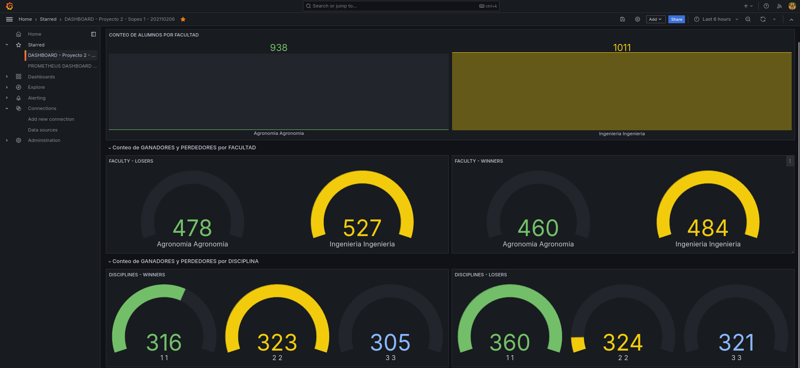

## <div align="center">Proyecto #2</div>
### <div align="center">Kubernetes y Servicios</div>
#### <div align="center">Olimpiadas USAC</div>
##### <div align="center">Sistemas Operativos 1 - Sección A</div>
##### <div align="center">1 de noviembre de 2024</div>
___

#### **<div align="center">Introducción</div>**

El proyecto 2 del curso de Sistemas Operativos 1 consistió en la construcción de un sistema/arquitectura para las Olimpiadas USAC, que se centró en la distribución de estudiantes y la obtención de ganadores y perdedores en las facultades participantes: Agronomía e Ingeniería. 

Los estudiantes de dichas facultades participarían en 3 diferentes disciplinas:

1. Natación
2. Atletismo
3. Boxeo

El diseño de la arquitectura del sistema se llevaría a cabo con la utilización de distintos lenguajes de programación; como Rust y Golang; caracterizados por su potencia, para utilizar hilos y manejar muchos procesos al mismo tiempo. 

Se utilizaría la herramienta de Kafka, desplegada con Strimzi, para utilizar topicos y colas, para distribuir los ganadores y los perdedores participantes en las olimpiadas. 

Por otro lado, se utilizaría la base de datos de Redis, donde se van insertando los datos, de los estudiantes ganadores y perdedores, al igual que se van realizando contadores, que serán útiles para luego visualizarlos graficamente en un dashboard elaborado con el servicio de monitorización Grafana. 

La arquitectura se realizó construyendo todas las aplicaciones y contenerizandolas y subiendolas a un registry, Docker Hub, para subir las aplicaciones y mantenerlas versionadas. Sería de gran ayuda, para poder tener un punto de partida y utlizar Kubernetes, para poder hacer que todo el sistema funcione. En este caso se utilizó GKE (Google KUbernetes Engine) para poder desplegar toda la arquitectura.

También se utilizaría una herramienta llamada; Prometheus. Que serviría para poder realizar un dashboard utilizando un template de la comunidad, para poder monitorizar los nodos, la memoria, cpu, y trafico que se tiene dentro del cluster de Kubernetes.

#### Arquitectura


____


#### **<div align="center">Configuracion Inicial GKE</div>**

Se configuran reglas de firewall para habilitar tráfico externo de entrada y de salida.


* **ALLIN**

<div align="center">

</div>


* **ALLOUT**

<div align="center">

</div>


Comando para crear cluster:

```bash
gcloud container clusters create proyecto2-202110206 \
    --zone us-central1-a \
    --num-nodes 5 \
    --disk-type=pd-standard \
    --disk-size=100
```


```bash
# Aplicar namespace

kubectl apply -f namespace.yaml
```

____

#### **<div align="center">Uso de Registry: Docker Hub</div>**

Se utilizó Docker Hub con el objetivo de poder subir todas las aplicaciones de la arquitectura y poder tenerlas contenerizadas y versionadas. Para así poder aplicarlas y desplegarlas en Kubernetes sin ningún problema.

<div align="center">

</div>

Se subieron 7 aplicaciones a Docker Hub.

1. **agronomia-go-container:** Consiste en la aplicación de Golang, que recibe por HTTP estudiantes de la Facultad de Agronomia y los redirige por gRPC a los contenedores de disciplinas. 
2. **ingenieria-rust-container:** Consiste en la aplicación de Rust, que recibe por HTTP estudiantes de la Facultad de Ingenieria y los redirige por gRPC a los contenedores de disciplinas. 
3. **atletismo-go-container:** Consiste en la aplicación de Golang para la disciplina de atletismo; que recibe por gRPC a los estudiantes provenientes de Agronomia e Ingenieria, provenientes de los contenedores agronomia-go-container e ingenieria-rust-container.
4. **natacion-go-container:** Consiste en la aplicación de Golang para la disciplina de natacion; que recibe por gRPC a los estudiantes provenientes de Agronomia e Ingenieria, provenientes de los contenedores agronomia-go-container e ingenieria-rust-container.
5. **boxeo-go-container:** Consiste en la aplicación de Golang para la disciplina de aboxeo; que recibe por gRPC a los estudiantes provenientes de Agronomia e Ingenieria, provenientes de los contenedores agronomia-go-container e ingenieria-rust-container.
6. **winners-go-consumer:** Consiste en el contenedor de Golang que consume el topic winners creado en Kafka con Strimzi, que recibe el estudiante y se conecta con la base de datos de Redis e inserta al estudiante.
7. **losers-go-consumer:** Consiste en el contenedor de Golang que consume el topic losers creado en Kafka con Strimzi, que recibe el estudiante y se conecta con la base de datos de Redis e inserta al estudiante.


____

#### **<div align="center">Funcionamiento y Comandos de Kubernetes</div>**

Creación de reglas de firewall de entrada y salida.

Instalación de Helm y NGINX-Ingress-Controller para poder facilitar la entrada de tráfico en la arquitectura.

#### 1. Ingress

Permite la entrada de tráfico, mediante Locust, que publicará automaticamente, a los dos endpoints disponibles en el sistema de olimpiadas.

1. "/agronomia"
2. "/ingenieria"

<div align="center">

</div>

Usar NGINX controller con Helm.

Se instala HELM localmente:

```bash
curl https://baltocdn.com/helm/signing.asc | gpg --dearmor | sudo tee /usr/share/keyrings/helm.gpg > /dev/null
sudo apt-get install apt-transport-https --yes
echo "deb [arch=$(dpkg --print-architecture) signed-by=/usr/share/keyrings/helm.gpg] https://baltocdn.com/helm/stable/debian/ all main" | sudo tee /etc/apt/sources.list.d/helm-stable-debian.list
sudo apt-get update
sudo apt-get install helm
```

Para crear ingress para poder enviar peticiones, se utiliza nginx-ingress.

```bash
kubectl create ns nginx-ingress
helm repo add ingress-nginx https://kubernetes.github.io/ingress-nginx 
helm repo update 
helm install nginx-ingress ingress-nginx/ingress-nginx -n nginx-ingress
kubectl get services -n nginx-ingress # Se obtiene la IP Load Balancer, la misma de INGRESS
```

Se ingresa el host en Locust: http://34.57.51.101.nip.io (Es la IP del balanceador de carga)


```bash
# Aplicar ingress

kubectl apply -f ingress.yaml
```


#### 2. Facultades


<div align="center">

</div>


- Aplicación de Deployment y Service 

```bash
# AGRONOMIA
kubectl apply -f goclient.yaml

# INGENIERIA
kubectl apply -f rustclient.yaml
```

```bash

# Se aplica HPA para ambos deployments
kubectl apply -f hpa-go-client.yaml

kubectl apply -f hpa-rust-client.yaml
```


#### 2. Disciplinas

<div align="center">

</div>


- Aplicación de Deployment y Service

```bash
# NATACION
kubectl apply -f gonatacion.yaml

# BOXEO
kubectl apply -f goboxeo.yaml

# ATLETISMO
kubectl apply -f goatletismo.yaml
```


#### 3. Kafka

Se utiliza kafka, para el envío y recepción de datos/mensajes en forma de colas.

* Se utilizan dos topicos en Kafka:
    * winners: contiene a los estudiantes ganadores
    * losers:  contiene a los estudiantes perdedores

Se instala Strimzi en el namespace creado del proyecto:

```bash
kubectl create -f 'https://strimzi.io/install/latest?namespace=sopes1' -n sopes1

# Desplegar el cluster de kafka 

kubectl apply -f https://strimzi.io/examples/latest/kafka/kafka-persistent-single.yaml -n sopes1

# Aplicar topicos definidos en el archivo kafka-topics.yaml
kubectl apply -f kafka-topics.yaml -n sopes1
```

```bash
# Se puede utilizar para verificar el pod de kafka, para ver mensajes
kubectl exec -it my-cluster-kafka-0 -n sopes1 -- /bin/bash

# Se puede verificar los mensajes recibidos en los topicos, winners o losers.

/opt/kafka/bin/kafka-console-consumer.sh --bootstrap-server localhost:9092 --topic winners --from-beginning
/opt/kafka/bin/kafka-console-consumer.sh --bootstrap-server localhost:9092 --topic losers --from-beginning
```

#### 4. Consumidores Kafka 

<div align="center">

</div>


Los consumidores recibirán los mensajes de los tópicos de kafka, para insertarlos en redis.

```bash
# TOPIC: WINNERS
kubectl apply -f consumer-winners.yaml

# TOPIC: LOSERS
kubectl apply -f consumer-losers.yaml
```


#### 5. Redis

Redis es una base de datos en memoria, rápida y con capacidad para almacenar datos clave-valor. En el proyecto, se utilizan hashes para almacenar estudiantes, y tambien se utilizan contadores; todo generado por los consumidores de Golang.

Agregar el repositorio de Helm para Redis:

```bash
helm repo add bitnami https://charts.bitnami.com/bitnami
helm repo update
```
Instalar redis con helm.

```bash
helm install redis-db bitnami/redis --namespace sopes1 --create-namespace
```
Verificar contraseña de redis.

```bash
export REDIS_PASSWORD=$(kubectl get secret --namespace sopes1 redis-db -o jsonpath="{.data.redis-password}" | base64 -d)
echo $REDIS_PASSWORD
```

**Verficar en pods de redis, si se guarda info**

```bash
kubectl exec -it redis-db-master-0 --namespace sopes1 -- redis-cli

AUTH XKcuMbTOcn

# Verificar todas las claves de ganadores
KEYS "winner:*"

# Acceder a los datos de un estudiante específico
HGETALL "winner:nombre"
```

#### 6. Grafana - Prometheus

Grafana es una herramienta para crear dashboards y visualizar datos en tiempo real. En el proyecto, se conecta dentro del cluster a redis, para poder obtener los datos de los contadores de estudiantes, util para poder visualizarlos y tener una retrospectiva del sistema de olimpiadas USAC.

<div align="center">

</div>

Se usa helm para instalar grafana y prometheus.
Se exponen los puertos, para poder acceder.

```bash
ACCOUNT=$(gcloud info --format='value(config.account)')
kubectl create clusterrolebinding owner-cluster-admin-binding \
    --clusterrole cluster-admin \
    --user $ACCOUNT

helm repo add prometheus-community https://prometheus-community.github.io/helm-charts
helm repo update

helm install my-kube-prometheus-stack prometheus-community/kube-prometheus-stack --namespace sopes1 --create-namespace


kubectl expose service my-kube-prometheus-stack-prometheus \
    --type=NodePort \
    --target-port=9090 \
    --name=prometheus-node-port-service \
    -n sopes1

kubectl expose service my-kube-prometheus-stack-grafana \
    --type=NodePort \
    --target-port=3000 \
    --name=grafana-node-port-service \
    -n sopes1


#contraseña de grafana

kubectl get secret --namespace sopes1 my-kube-prometheus-stack-grafana -o jsonpath="{.data.admin-password}" | base64 --decode ; echo

user: admin
password: prom-operator

```

IP EXTERNA DE NODO:
CON NODE PORTS:

GRAFANA:
http://35.226.117.187:32425

PROMETHEUS:
http://35.226.117.187:32519

____

### Conectarse a Redis en Grafana

Ya habiendo iniciado sesión en Grafana, uno puedo conectarse, accediendo en las opciones de new connection, hay que agregar a Redis. (Instalar si no se tiene y luego se tiene que añadir un nuevo data source.)

<div align="center">

</div>


Al crear un nuevo Data Source, se debe de ingresar la dirección de redis y su contraseña (esta se encuentra en el cluster, en este caso sería:)

Address: redis-db-master.sopes1.svc.cluster.local:6379
Password: XKcuMbTOcn

<div align="center">

</div>

Ya se tiene conectado a la base de datos de Redis, y ya se podrán construir consultas para crear visualizaciones.

<div align="center">

</div>

Se pueden crear queries en Grafana y se puede obtener la información almacenada en la base de datos de Redis:

Por ejemplo para obtener un contador creado en Redis:

- HGET "nombre_contador" "valor"

En este caso se tiene un contador que se crea desde los consumers; y se puede obtener la informacion del conteo de estudiantes por facultad; en este caso en Grafana se hace el query de la siguiente forma:

- HGET "new_faculty_count" "Agronomia"
- HGET "new_faculty_count" "Ingenieria" 

Se obtendrían los contadores tanto para Agronomia como para Ingenieria.


____

#### VISUALIZACION FINAL 

**Grafana:**

Esta sería la visualización final del dashboard creado para el Sistema de OLIMPIADAS USAC; se puede observar:

- Conteo de alumnos por facultad.
- Conteo de ganadores y perdedores por facultad.
- Conteo de ganadores y perdedores por disciplina.



**Prometheus:**

Con Prometheus se pueden utilizar templates creados en la comunidad, en este caso se utilizó el siguiente, para poder visualizar y monitorizar el rendimiento del cpu, memoria y trafico de red, en cada nodo del clúster de kubernetes.

https://grafana.com/grafana/dashboards/1860-node-exporter-full/

