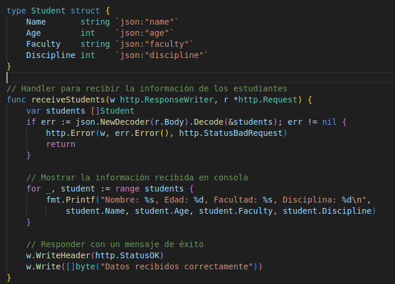

## <div align="center">Hoja de Trabajo - Envío de tráfico con Locust y Recepción con contenedor de Golang</div>
##### <div align="center">Sistemas Operativos 1 - Sección A</div>
##### <div align="center">19 de octubre de 2024</div>

___

Para la hoja de trabajo del laboratorio del curso de Sistemas Operativos 1, se realizó el envío de tráfico con Locust (libería de Python) para poder generar información y enviarla a un contenedor donde contiene una aplicación elaborada con el lenguaje de programación de Golang. 

Se realizará la prueba de comunicación subiendo la imagen del programa de Golang a Docker Hub y poder acceder a ella, mediante un deployment en un cluster de Kubernetes en Google Cloud. 

### <div align="center">INSTALACIÓN LOCUST</div>

Se utiliza el comando para instalar de forma local:
```bash
pip install locust

locust --version #Sirve para ver la versión de Locust instalado
```

Se crea un archivo locustfile.py, donde se configura Locust, para que pueda enviar las peticiones de tráfico de información a la API de Golang. (Se envía información random, considerando la estructura tipo Estudiante del Proyecto2)


### <div align="center">CONTENEDOR GOLANG</div>

Se configura un servidor HTTP en Golang que recibe peticiones POST en la ruta /students con un JSON que contiene información de varios estudiantes. 

Se usa la estructura tipo Estudiante, que se utilizará en el Proyecto 2.



#### Uso de Docker para contenerizar la aplicación de Golang

Se crea un archivo Dockerfile para crear la imagen y luego el contenedor con el servidor sencillo de Golang.

```bash
docker build -t juliozaldana/go-container:latest .

#Subir imagen a DockerHub.

docker login

docker push juliozaldana/go-container:latest
```


_____

### <div align="center">RESUMEN DE FLUJO EN GKE</div>

1. **Deployment:** Define el pod con el contenedor de Golang.
2. **Service:** Se expone el contenedor Golang en el clúster de Kubernetes.
3. **Ingress:** Proporciona acceso externo al servicio a través de un controlador Ingress.
4. **Locust:** Se ejecuta Locust localmente para enviar peticiones hacia la aplicación Golang en Kubernetes a través del Ingress.


Se configurar reglas de firewall para habilitar tráfico externo de entrada.

Comando para crear cluster:

```bash
gcloud container clusters create ht-locust-golang   --zone us-central1-a   --num-nodes 3
```


Comandos para desplegar en Kubernetes:

```bash
kubectl apply -f namespace.yaml
kubectl apply -f deployment.yaml
kubectl apply -f service.yaml
kubectl apply -f ingress.yaml
```

Verificar los logs en tiempo real, del contenedor golang en un pod.

```bash
kubectl logs -f <name_pod>
```

1. Usar NGINX controller con Helm: 

```bash
curl https://baltocdn.com/helm/signing.asc | gpg --dearmor | sudo tee /usr/share/keyrings/helm.gpg > /dev/null
sudo apt-get install apt-transport-https --yes
echo "deb [arch=$(dpkg --print-architecture) signed-by=/usr/share/keyrings/helm.gpg] https://baltocdn.com/helm/stable/debian/ all main" | sudo tee /etc/apt/sources.list.d/helm-stable-debian.list
sudo apt-get update
sudo apt-get install helm
```

2. Crear ingress para poder enviar peticiones

```bash
kubectl create ns nginx-ingress
helm repo add ingress-nginx https://kubernetes.github.io/ingress-nginx 
helm repo update 
helm install nginx-ingress ingress-nginx/ingress-nginx -n nginx-ingress
kubectl get services -n nginx-ingress # Se obtiene la IP Load Balancer, la misma de INGRESS
```

3. Ejecutar Locust, de forma local:


4. Se obtiene la ip address de Ingress para conectarse a Locust localmente.


Se ingresa el host en Locust: http://34.42.158.60 (Es la IP del balanceador de carga)

Se obtiene el "nombre" de un pod (existen 2 replicas), para ver los logs en tiempo real, del programa de golang.

Y se inicializa el proceso en Locust, para enviar tráfico.

