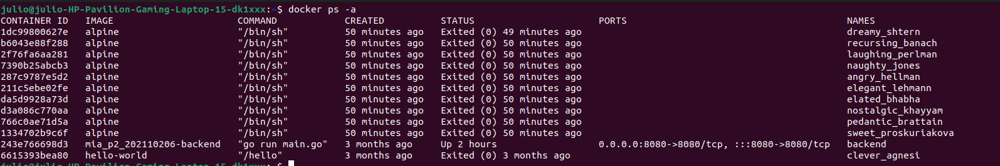

## <div align="center">Tarea #2 - Creación de Contenedores en Docker</div>
##### <div align="center">Sistemas Operativos 1 - Sección A</div>
##### <div align="center">17 de agosto de 2024</div>
___

Para la Tarea #2 del laboratorio del curso de Sistemas Operativos 1, se utilizó Docker para la creación de una imagen, y creación de contenedores.

Como ejemplo se hizo uso de la imagen Alpine:


Como se puede notar, es pequeña en tamaño y bajo en consumo de recursos, ideal para el ejemplo.

En el archivo de bash; [scriptdocker.sh](./scriptdocker.sh), se puede notar que para poder crear 10 contenedores al momento de ejecutar el script, se utiliza un ciclo for iterando hasta 10 veces.


La imagen es alpine:
```bash
IMAGE="alpine"
```
Se utiliza el comando, para crear un contenedor con base a la imagen.
```bash
docker run -d $IMAGE
```

**NOTA:** Como no se especifica el nombre con --name "nombrecontenedor", entonces Docker por default generará un nombre aleatorio para el contenedor.

Y se añadieron siempre los permisos de ejecución con

```bash
chmod +x scriptdocker.sh
```

**Resultado:**





Como se puede observar al ejecutar el script, se crearon los 10 contenedores con base a la imagen de Alpine, con nombres aleatorios.
_____

### Opcion 2
Para generar nombres aleatorios tambien se puede utilizar /dev/urandom

```bash
CONTAINER_NAME=$(cat /dev/urandom | tr -dc 'a-z0-9' | fold -w 10 | head -n 1)
```

Y se generarán igual los contenedores, pero ya no como la forma predeterminada con nombres aleatorios de Docker, sino como la forma de generación de numeros/letras aleatorias de Unix.

_____

### Referencias

- https://esgeeks.com/que-son-dev-random-urandom/
- https://kodekloud.com/blog/create-docker-images/