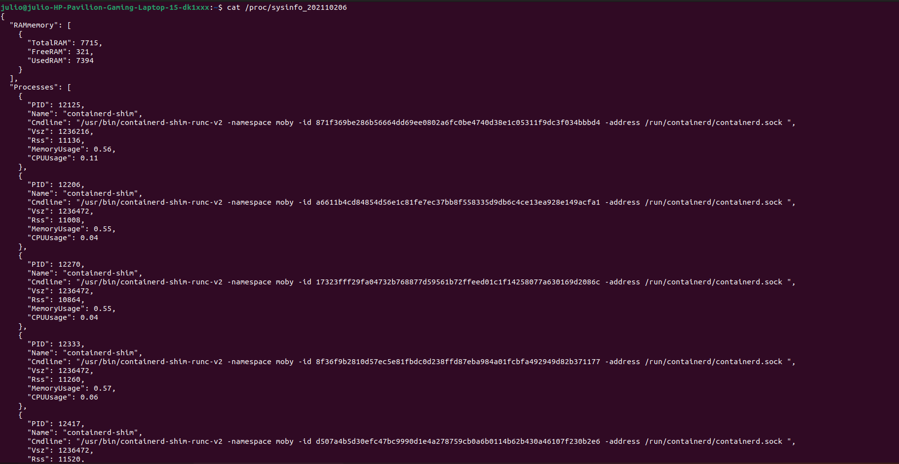
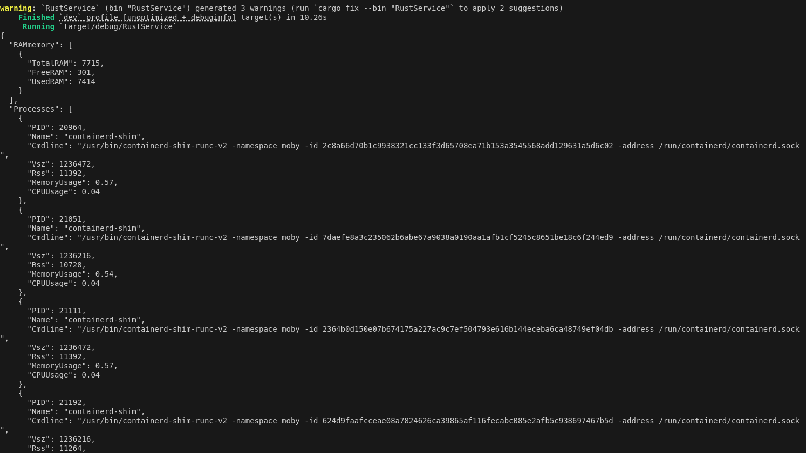
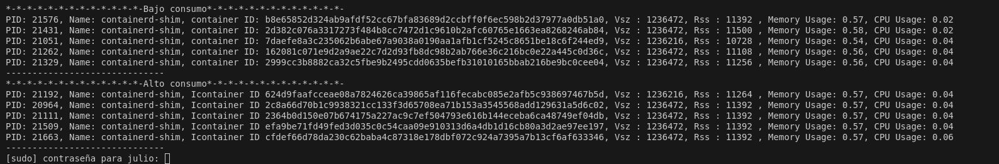
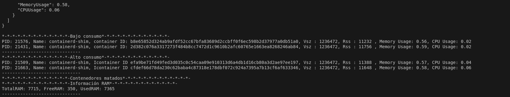

## <div align="center">Tarea #3 - Servicio de Rust</div>
##### <div align="center">Sistemas Operativos 1 - Sección A</div>
##### <div align="center">31 de agosto de 2024</div>

___

Para la tarea #3 del laboratorio del curso de Sistemas Operativos 1, se realizó un servicio utilizando el lenguaje de programación **Rust**. 

<div style="text-align: center;">
    
    
</div>


Este es el programa que contiene el funcionamiento más importante detrás del [Proyecto #1](/SO1_2S2024_202110206/Proyecto1/RustService/src/main.rs). Que trabaja como un gestor de contenedores Docker, con los siguientes funcionamientos.

1. Lee el archivo sysinfo_202110206 en la carpeta /proc, donde contiene la información en formato JSON, de los procesos relacionados a los contenedores de Docker que están corriendo en ese momento y también la información de la memoria RAM.

2. Se deserializa la información en formato JSON para guardarlo en un struct llamado Sysinfo, y después almacenarlo en Processes y Rammemory, para luego almacenarlo en diferentes structs. 

3. Al manejar la información de los procesos, se realiza una serie de ordenamientos por:
    * RAM
    * CPU
    * VSZ
    * RSS
4. Después se organizan y se toman los contenedores de alto consumo y los contenedores de bajo consumo, para luego tomar los 3 contenedores con más alto consumo y los 2 con más bajo consumo y eliminarlos. Dejando solo 2 de alto consumo y 3 de bajo consumo.
5. Se imprime en la consola la información, de los contenedores de alto consumo y de bajo consumo, los contenedores que se van eliminando y la información de memoria RAM.

___

### <div align="center"> Capturas </div>

Archivo en formato JSON, en **/proc/sysinfo_202110206**, con la información capturada de los procesos respectivos a los contenedores Docker corriendo.



Lo que hace en esencia el programa/servicio de Rust, es ir a leer el archivo de /proc/sysinfo_202110206, y deserializar con serde.

Almacenar la información en el struct sysinfo, y luego distribuirla como structs Processes y Rammemory, para luego guardar todo en vectores y hacer los ordenamientos sobre esos vectores, para luego imprimir la información.

Para iniciar con el servicio se utiliza el comando:

```rust
cargo run
```
Se captura la información del archivo sysinfo_202110206 en formato JSON con Rust.




Se presentan los procesos de bajo consumo y de alto consumo.





[Ejemplo de salida en la consola](./salidarust.txt)
_____

### <div align="center">Referencias </div>

Instalación Rust
- https://doc.rust-lang.org/book/ch01-01-installation.html
