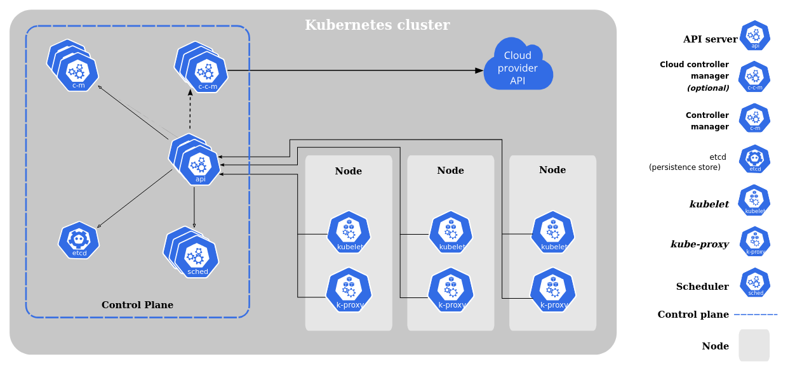
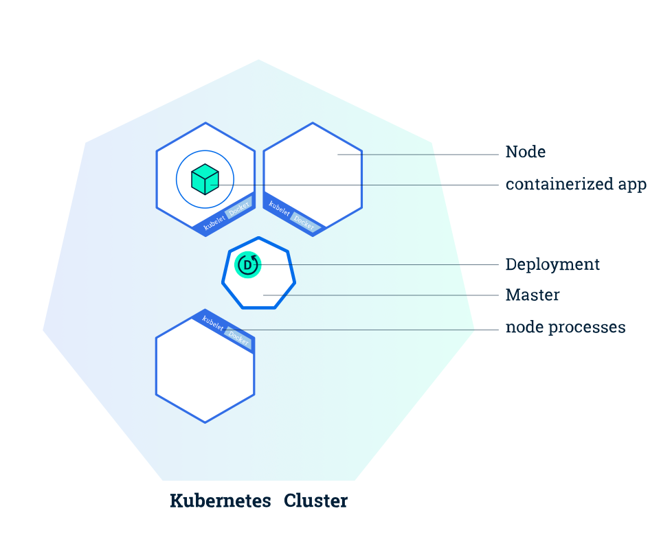
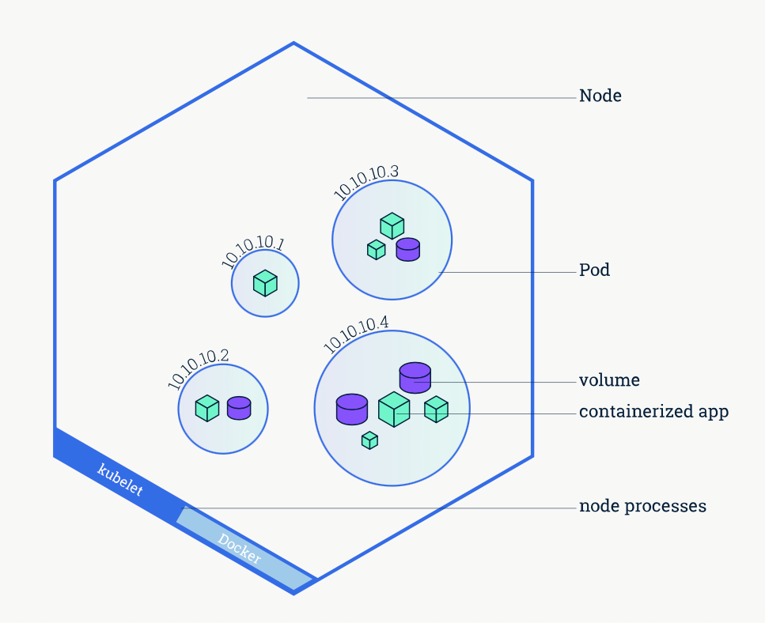
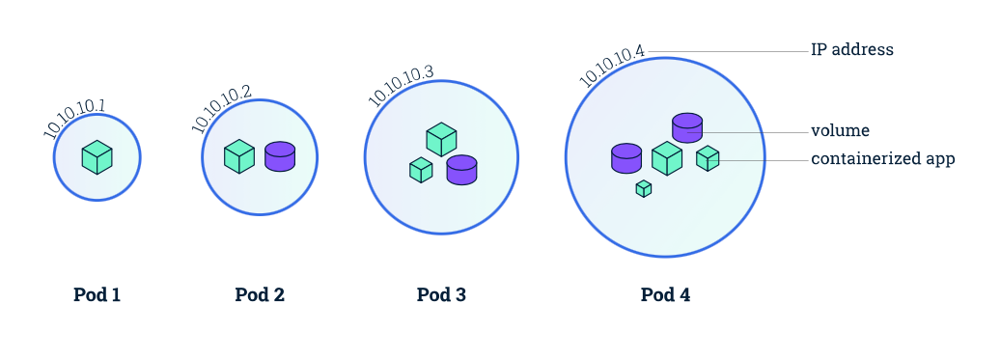
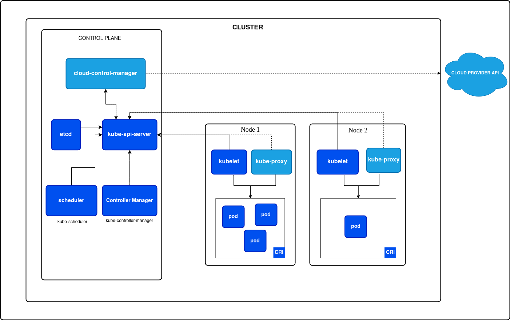
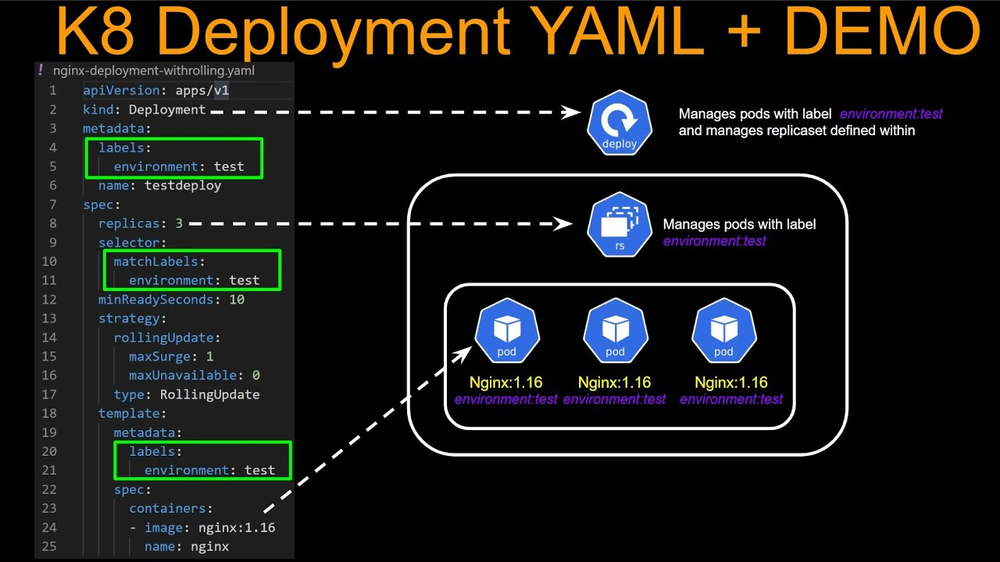

## 
Tarea #4 - Google Kubernetes Engine y Aplicación NGINX

##### 
Sistemas Operativos 1 - Sección A

##### 
5 de octubre de 2024

___

Para la tarea #4 del laboratorio del curso de Sistemas Operativos 1, se desplegó la aplicación de NGINX, utilizando Google Kubernetes Engine (GKE) en Google Cloud Platform (GCP).

_____

### 
 Funcionamiento de Kubernetes 

**¿Qué es Kubernetes?**

Kubernetes consiste principalmente en ser un orquestador de contenedores. Con el objetivo de formar un ecosistema de contenedores o microservicios.

**Componentes:**

**Clúster:** Es un conjunto de máquinas que trabajan juntas para ejecutar aplicaciones contenerizadas. Cada máquina tiene un rol diferente en el sistema.

Un clúster de kubernetes consiste en un componente llamado control plane, y uno o más nodos.

*Componentes del Control Plane*

El control plane es como el maestro de orquesta; ya que es el que coordina el clúster.

- **kube-apiserver:** Es el componente que expone la HTTP API de Kubernetes. Donde recibe solicitudes de los usuarios y del propio clúster.
- **etcd:** Es la base de datos que almacena toda la información del clúster, desde los nodos hasta los pods.
- **kube-scheduler:** Asigna los pods a los nodos adecuados, basándose en la disponibilidad de recursos y restricciones.
- **kube-controller-manager:** Se encarga de manejar los controladores que aseguran que el clúster alcance el estado deseado (por ejemplo, reiniciar pods caídos)
- **cloud-controller-manager:** (opcional)

**¿Qué son los Nodos?**

Los nodos son las máquinas (servidores) que ejecutan las aplicaciones. En un clúster de Kubernetes, puede haber múltiples nodos. 

Cada nodo es administrado por el Control Plane.

Cada nodo tiene un **Kubelet**, que es un agente que se asegura de que los contenedores se ejecuten y permanezcan en buen estado, aparte que se asegura de conectarse al apiserver, además de otros componentes como:

* Container Runtime: Normalmente Docker (o containerd), es el software que ejecuta los contenedores.
* Kube-proxy: Se encarga del enrutamiento del tráfico de red hacia los contenedores.

**¿Qué son los Pods?**

En Kubernetes, un **pod** es la unidad básica/unidad atómico de despliegue y gestión. Los pods son envoltorios que contienen uno o más contenedores (normalmente uno).

Estos contenedores en un pod comparten la misma red y sistema de almacenamiento, lo que les permite comunicarse de manera rápida y eficiente. 

Un pod es como un conjunto de contenedores que necesitan estar muy cerca unos de otros y compartir recursos.

**Relación entre Nodos y Pods:**

* **Nodos:** Pueden tener muchos pods en ejecución, dependiendo de la capacidad de los nodos y los recursos que requieran los pods (CPU, memoria, etc.)

* **Pods:** Contienen uno o más contenedores que funcionan juntos para ejecutar una aplicación o parte de una aplicación. Los pods se crean y destruyen dinámicamente conforme se escalan las aplicaciones o se necesita más capacidad.

Cada pod, puede tener n cantidad de contenedores y n cantidad de volumenes (base de datos).
Para poder acceder a los pods, el proxy le asigna una dirección IP. 

Los Pods crean un ecosistema para encapsular los contenedores. A querer comunicarse con otro pod, entra el tema de servicios. Compartir información con distintos pods. Las IPs son efímeras. Si se elimina un pod, la IP será distinta.

Para acceder a los Pods, se necesita utilizar la kubelet, que es como la CLI que ofrece Kubernetes.

NOTA: Como buena práctica se debería de tener solamente un contenedor en un pod, es decir tener una funcionalidad por pod.

**Arquitectura de un clúster de Kubernetes**

**Deployment**

Un deployment es una implementación que administra un conjunto de pods, para ejecutar una carga de trabajo de aplicación. Se puede definir utilizando reglas. 

Un deployment, puede ser un pod o un servicio. Que servirá para crear una pequeña arquitectura. 

Un pod va dentro de un deployment. Y el deployment será util para construir el pod y el service.

**Service**
Es un método para exponer una aplicación de red.

**Ingress**
Dirige el tráfico a los diferentes pods.

Construir pods y liberar puertos, y mediante el servicio; poder enrutar el tráfico o las peticiones. 

El cliente va a inyectar trafico al clúster. La puerta que va a estar abierta, mediante el Ingress, que son reglas. Que routee la información a los pods, y esto se hará por medio del Service.

______

### 
 Referencias 

- https://kubernetes.io/docs/concepts/overview/components/
- https://kubernetes.io/docs/concepts/architecture/